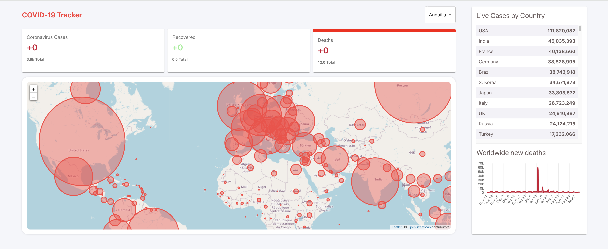

# COVID-19 Tracking App

This project is a COVID-19 Tracking Application built with **React** using **Create React App**. It provides real-time COVID-19 data visualization, including global and country-specific statistics.

## Features
- 🌍 **Global and Country-specific COVID-19 Data**
- 📊 **Interactive Graphs and Charts**
- 🔄 **Real-time Updates**
- 📱 **Responsive Design**

## Tech Stack
- **React**
- **Chart.js** for visualizations
- **Axios** for API requests
- **CSS** for styling

## Installation

1. Clone the repository:
   ```bash
   git clone https://github.com/yourusername/covid19-tracking-app.git
   cd covid19-tracking-app
   ```

2. Install dependencies:
   ```bash
   npm install
   ```

3. Start the development server:
   ```bash
   npm start
   ```
   Open [http://localhost:3000](http://localhost:3000) in your browser.

## Available Scripts

### `npm start`
Starts the app in development mode.

### `npm test`
Launches the test runner.

### `npm run build`
Builds the app for production.

### `npm run eject`
Ejects the app configuration (use with caution).

## API
This app uses a COVID-19 data API. You can integrate any public COVID-19 API of your choice, such as [disease.sh](https://disease.sh/) or [COVID-19 API](https://covid19api.com/).

## Deployment
Build the app using:
```bash
npm run build
```
Deploy it on platforms like **Netlify**, **Vercel**, or **GitHub Pages**.
## Screenshot

## Demo
View the project demo here: [Live Demo](https://covid-19-tracker-mobile-35633.web.app/)

## Learn More
- [React Documentation](https://reactjs.org/)
- [Create React App Documentation](https://create-react-app.dev/)

## Contributing
Contributions are welcome! Feel free to open issues or submit pull requests.
